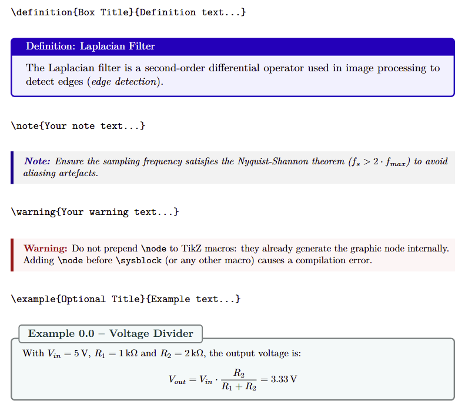
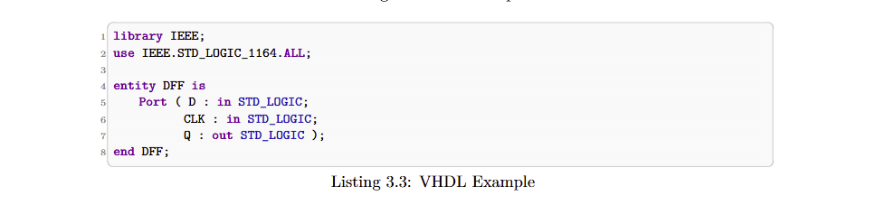

# EngTeX — Engineering LaTeX Template

> **Professional LaTeX template for technical reports, lab reports, and project documentation in engineering and IT.**
> 
> *Template LaTeX professionale per relazioni tecniche, report di laboratorio e documentazione di progetto in ambito ingegneristico e IT.*


---

## 📄 Preview

| Italian Manual | English Manual |
|:-:|:-:|
| [📥 ITA_Manuale.pdf](preview/ITA_Manuale.pdf) | [📥 ENG_Manual.pdf](preview/ENG_Manual.pdf) |

---

## ✨ Features

### 🎨 Custom Graphic Boxes
Four visual environments, available in **English and Italian**, invoked with a single command:

| Command (EN) | Alias (IT) | Style |
|---|---|---|
| `\definition{Title}{Text}` | `\definizione` | Blue box with title |
| `\note{Text}` | `\nota` | Grey-blue lateral bar |
| `\warning{Text}` | `\attenzione` | Red lateral bar |
| `\exemplo{Title}{Text}` | `\esempio` | Teal numbered box |



---

### 💻 Syntax Highlighting for 6 Languages
Dedicated style for each language, with both block and inline support:

| `style=` | Language | Inline command |
|---|---|---|
| `vhdl` | VHDL (IEEE 1076-2008) | `\vhdlinline{}` |
| `c` | C | `\cinline{}` |
| `cpp` | C++ | `\cppinline{}` |
| `java` | Java | `\javainline{}` |
| `python` | Python | `\pythoninline{}` |
| `matlab` | MATLAB | `\matlabinline{}` |



---

### 📐 STEM Math Macros
Shortcuts for the most common notations in engineering:

```latex
\der{f}{x}          % df/dx
\laplace{h(t)}      % Laplace transform
\fasore{220}{30°}   % phasor notation
\RR, \NN, \ZZ, \CC  % number sets
\norm{x}            % vector norm
\notlog{A \cdot B}  % Boolean NOT
```

---

### 🔧 Document Tools
- **Version control** — `\renewcommand{\versiondoc}{1.0}` in `main.tex`, auto-propagates to cover page
- **Automatic acronyms** — first occurrence expanded, subsequent abbreviated (`acro` package)
- **IEEE bibliography** — `biblatex` + `biber`, numeric citations `[1]`, auto-generated section
- **SI units** — `\qty{150}{\MHz}`, `\qty{4.2}{\ns}` via `siunitx`

---

## 📂 File Structure

```
project/
├── main.tex                  ← entry point: customisation and chapter order
├── layout/
│   ├── stile_ingegneria.sty  ← template engine
│   ├── frontespizio.tex      ← cover page
│   └── bibliografia.bib      ← BibTeX references
├── capitoli/                 ← one .tex file per chapter
└── immagini/                 ← figures, diagrams, logos
└── docs/                     ← user manual and example reports
```

---

## 🚀 Getting Started

### Local — VS Code + MiKTeX ✅ (recommended)

1. Install [MiKTeX](https://miktex.org) and [VS Code](https://code.visualstudio.com) with the **LaTeX Workshop** extension
2. Extract the folder and open it in VS Code
3. Open `main.tex`, set the language option and edit the quick-customisation block
4. Build with `latexmk` — for bibliography: `pdflatex → biber → pdflatex → pdflatex`

### Overleaf ⚠️ (free plan limitations apply)

> The Overleaf **free** plan may time out due to heavy packages (`tcolorbox`, `tikz`, `biblatex`).  
> **Workaround:** temporarily comment out one chapter with `%` while editing, re-enable before final export.  
> Overleaf **Premium** compiles without issues.

1. Go to [overleaf.com](https://www.overleaf.com) → **New Project → Upload Project**
2. Upload the `.zip` without extracting it
3. Set compiler to **pdfLaTeX** (Menu → Compiler)

---

## ⚙️ Quick Customisation

```latex
% In main.tex — set document language:
\usepackage[english]{layout/stile_ingegneria}   % English labels
\usepackage[italian]{layout/stile_ingegneria}   % Italian labels

% Set document version:
\renewcommand{\versiondoc}{1.0}

% Declare acronyms:
\DeclareAcronym{fpga}{short=FPGA, long=Field Programmable Gate Array}
```

> **Golden rule:** only edit `main.tex` and files in `capitoli/`.  
> Use `\renewcommand` in `main.tex` to override defaults — do not edit `stile_ingegneria.sty` directly.

---

## 💼 Get the Full Template

This repository contains **preview PDFs and documentation only**.  
The full template with all source files is available on Gumroad:

<div align="center">

### [➡️ Get EngTeX on Gumroad — €26](https://sansalonelucag.gumroad.com/l/engtex)

Includes: all `.tex` source files · `stile_ingegneria.sty` · 2 complete example reports (IT + EN, ~11 pages each)

</div>

---

## 📋 What You Get

- ✅ Custom graphic boxes (EN + IT variants)
- ✅ VHDL syntax highlighting (IEEE 1076-2008, 4 keyword levels)
- ✅ C / C++ / Java / Python / MATLAB syntax highlighting
- ✅ TikZ macros for simple hardware datapaths and flowcharts
- ✅ Advanced math macros (transforms, phasors, Boolean algebra)
- ✅ IEEE bibliography with BibLaTeX
- ✅ Automatic acronym management
- ✅ Single-variable version control
- ✅ Complete example report — 4-bit counter on Xilinx Artix-7 (Italian)
- ✅ Complete example report — PWM controller on Xilinx Artix-7 (English)

---

*Made with ❤️ by [Luca Gaetano Sansalone](https://sansalonelucag.gumroad.com)*
