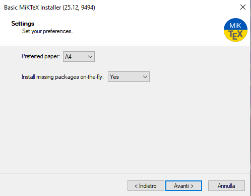
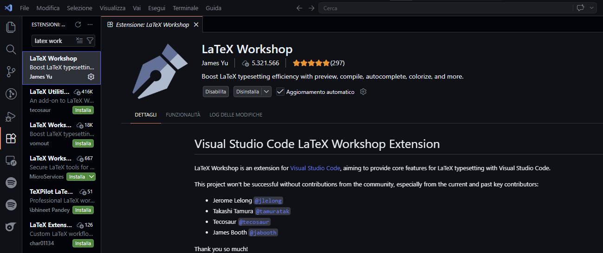
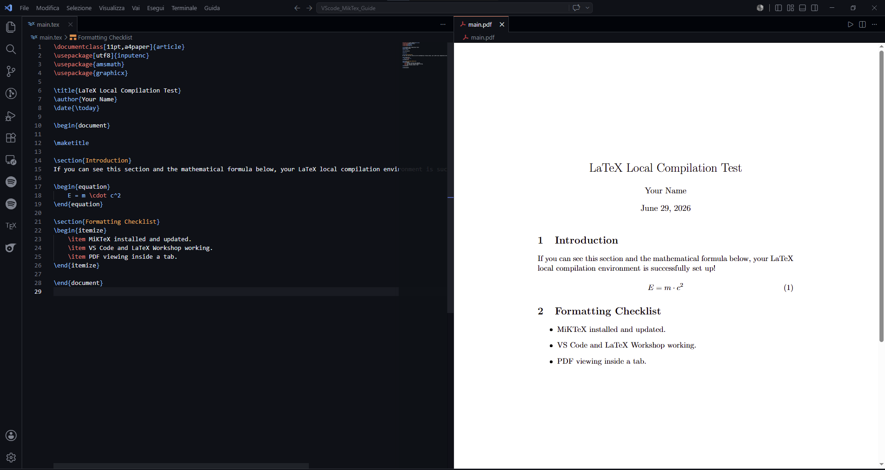

# <a name="top"></a>📄 VS Code + MiKTeX: Local LaTeX Environment Setup Guide

### 🇬🇧 English & 🇮🇹 Italiano

Welcome to the ultimate guide for setting up a local LaTeX editing environment on Windows (with support for macOS and Linux) using Visual Studio Code and MiKTeX. 

Benvenuto nella guida definitiva per configurare un ambiente di scrittura LaTeX locale su Windows (con supporto anche per macOS e Linux) utilizzando Visual Studio Code e MiKTeX.

---

## 🌐 Quick Language Selection / Selezione Rapida Lingua

Select your preferred language to jump straight to the guide:
Seleziona la tua lingua preferita per andare direttamente alla guida:

| [🇬🇧 English Version](#english-version) | [🇮🇹 Versione Italiana](#versione-italiana) |
|:---:|:---:|

---

# <a name="english-version"></a>🇬🇧 English Version

This guide will walk you through installing **MiKTeX** (the LaTeX engine), **Visual Studio Code** (the editor), and configuring them to compile LaTeX documents automatically on save, with an integrated PDF viewer.

---

## 🛠️ Prerequisites

- **Operating System:** Windows 10 or 11 (64-bit recommended). 
  *(Note: While this guide primarily targets Windows, both VS Code and MiKTeX also support macOS and Linux.)*
- **Internet Connection:** Required for downloading the software and LaTeX packages.

---

## 📥 Step 1: Install MiKTeX (LaTeX Engine)

### What is MiKTeX?
**MiKTeX** is a modern, open-source TeX/LaTeX distribution. Originally designed for Windows, it now officially supports macOS and Linux as well. A TeX distribution acts as the "back-end engine" that processes plain text `.tex` documents and compiles them into final typeset documents (like PDFs). 

It includes:
- **Compilers:** The core executable engines (such as `pdflatex` for standard work and `xelatex` for custom font compilation).
- **A Package Manager:** This is MiKTeX's best feature. Instead of downloading all LaTeX packages upfront (which takes gigabytes of space), MiKTeX downloads package and style files (*on-the-fly*) from the internet the moment you use them in a document.

1. **Download the Installer:**
   - Go to the official download page: [miktex.org/download](https://miktex.org/download).
   - Select the tab corresponding to your Operating System (**Windows**, **Mac**, or **Linux**).
   - Click the **Download** button to download the installer (e.g., `basic-miktex-...-x64.exe` for Windows).
     > [!NOTE]
     > *Note for macOS and Linux users:* While MiKTeX is fully supported on these platforms, the traditional standard distributions are **MacTeX** for macOS and **TeX Live** for Linux. However, you can use MiKTeX on all of them, and the VS Code configuration steps will remain identical.

2. **Run the Installer:**
   - Accept the copying conditions and click **Next**.
   - Choose whether to install MiKTeX for your user only or all users (installing for your user only is generally recommended and easier).
   - **Important Settings:**
     - Select your preferred paper size (e.g., A4).
     - **On-the-fly Package Installation:** Under "Install missing packages on-the-fly", change the setting to **`Yes`** (do *not* leave it as "Ask me first").
       > [!IMPORTANT]
       > Setting this to **Yes** is critical for VS Code. Compilation happens in the background, and if MiKTeX tries to open a prompt asking for permission to install a package, the VS Code compilation process will freeze.
   - Click **Next** and complete the installation.

   

3. **Check for Updates:**
   - Open the **MiKTeX Console** from your Windows Start Menu.
   - Go to **Updates** in the sidebar.
   - Click **Check for updates**. If any updates are found, click **Update now**.
   - Keeping MiKTeX updated resolves 90% of compile errors.

### ⚙️ How to Manually Add MiKTeX to the Windows PATH Variable (If Needed)
Normally, the MiKTeX installer adds its binaries folder to your Windows system path automatically. However, if you run into errors like `"Recipe terminated with error"` in VS Code and your compiler logs state that `pdflatex is not recognized as an internal or external command`, you must register MiKTeX in the Windows Environment Variables manually:

1. **Find your MiKTeX executable folder path:**
   - **For User-Only installations (Recommended):**
     `C:\Users\<YOUR_USERNAME>\AppData\Local\Programs\MiKTeX\miktex\bin\x64\`
     *(Note: Replace `<YOUR_USERNAME>` with your Windows login username. Since `AppData` is a hidden directory, you can copy `%LOCALAPPDATA%\Programs\MiKTeX\miktex\bin\x64` and paste it into your Windows Explorer address bar to open it directly.)*
   - **For All-Users installations:**
     `C:\Program Files\MiKTeX\miktex\bin\x64\`
2. **Copy the path** to your clipboard.
3. Open the Windows **Start Menu**, search for **"Environment Variables"**, and select **"Edit the system environment variables"**.
4. In the window that opens, click the **"Environment Variables..."** button at the bottom.
5. In the top section ("User variables for <your-username>"), find the variable named **`Path`** (or **`PATH`**), select it, and click **"Edit..."**.
6. Click **"New"** on the right side, and paste the folder path you copied in Step 1.
7. Click **"OK"** to save and exit all configuration windows.
8. **Important:** Restart VS Code completely so that it registers the updated environment variables.

---

## 💻 Step 2: Install Visual Studio Code

### What is Visual Studio Code?
**Visual Studio Code (VS Code)** is a free, lightweight, and extremely powerful source-code editor developed by Microsoft. Out of the box, it is a general-purpose text editor (it doesn't compile LaTeX files on its own). 

By adding the **LaTeX Workshop** extension, we convert VS Code into an advanced LaTeX Integrated Development Environment (IDE) that provides:
- Syntax highlighting and autocomplete for commands and packages.
- SyncTeX support (jump directly from a line of LaTeX code to its corresponding line in the PDF, and vice versa).
- Side-by-side PDF preview that updates automatically upon saving your work.

1. **Download VS Code:**
   - Go to [code.visualstudio.com](https://code.visualstudio.com/).
   - Click **Download for Windows** (User Installer).
2. **Installation:**
   - Run the installer, accept the agreement, and follow the steps.
   - On the "Select Additional Tasks" screen, we recommend checking:
     - *Add "Open with Code" action to Windows Explorer file/directory context menu* (makes it very easy to open folders).
     - *Add to PATH* (checked by default).
   - Finish the installation and launch VS Code.

---

## 🔌 Step 3: Install the LaTeX Workshop Extension

To turn VS Code into a powerful LaTeX IDE, we need the **LaTeX Workshop** extension.

1. Open VS Code.
2. Click on the **Extensions** icon on the left Activity Bar (shortcut: `Ctrl+Shift+X`).
3. Search for `LaTeX Workshop` (by James Yu).
4. Click **Install**.



---

## ⚙️ Step 4: Configuration & Customization

Let's configure VS Code to automatically compile files when you save, use clean temporary directories, and show the PDF side-by-side.

1. In VS Code, open the Command Palette with `Ctrl+Shift+P`.
2. Type `Preferences: Open User Settings (JSON)` and press **Enter**.
3. Paste the following configuration block inside the main curly braces `{}`. If you already have settings, make sure to add a comma `,` before pasting:

```json
  // --- LaTeX Workshop Configuration ---
  "latex-workshop.latex.autoBuild.run": "onSave",
  "latex-workshop.view.pdf.viewer": "tab",
  "latex-workshop.latex.recipes": [
    {
      "name": "pdflatex (fast)",
      "tools": [
        "pdflatex"
      ]
    },
    {
      "name": "pdflatex ➞ biber ➞ pdflatex x2",
      "tools": [
        "pdflatex",
        "biber",
        "pdflatex",
        "pdflatex"
      ]
    },
    {
      "name": "pdflatex ➞ bibtex ➞ pdflatex x 2",
      "tools": [
        "pdflatex",
        "bibtex",
        "pdflatex",
        "pdflatex"
      ]
    },
    {
      "name": "xelatex ➞ bibtex ➞ xelatex x 2",
      "tools": [
        "xelatex",
        "bibtex",
        "xelatex",
        "xelatex"
      ]
    }
  ],
  "latex-workshop.latex.tools": [
    {
      "name": "pdflatex",
      "command": "C:/Users/Luca/AppData/Local/Programs/MiKTeX/miktex/bin/x64/pdflatex.exe",
      "args": [
        "-synctex=1",
        "-interaction=nonstopmode",
        "-file-line-error",
        "%DOC%"
      ]
    },
    {
      "name": "xelatex",
      "command": "C:/Users/Luca/AppData/Local/Programs/MiKTeX/miktex/bin/x64/xelatex.exe",
      "args": [
        "-synctex=1",
        "-interaction=nonstopmode",
        "-file-line-error",
        "%DOC%"
      ]
    },
    {
      "name": "bibtex",
      "command": "C:/Users/Luca/AppData/Local/Programs/MiKTeX/miktex/bin/x64/bibtex.exe",
      "args": [
        "%DOCFILE%"
      ]
    },
    {
      "name": "biber",
      "command": "biber",
      "args": [
        "%DOCFILE%"
      ]
    }
  ],
  "latex-workshop.latex.clean.enabled": true,
  "latex-workshop.latex.clean.fileTypes": [
    "*.aux",
    "*.bbl",
    "*.blg",
    "*.idx",
    "*.ind",
    "*.lof",
    "*.lot",
    "*.out",
    "*.toc",
    "*.acn",
    "*.acr",
    "*.alg",
    "*.glg",
    "*.glo",
    "*.gls",
    "*.ist",
    "*.fls",
    "*.log",
    "*.fdb_latexmk"
  ],
  "latex-workshop.message.log.show": false,
  "latex-workshop.message.error.show": false,
  "latex-workshop.message.warning.show": false
}

```

> [!TIP]
> **Why this configuration?**
> - **Auto Build on Save:** Your document compiles automatically whenever you hit `Ctrl+S`.
> - **View in Tab:** The PDF is displayed as a tab inside VS Code, updating in real-time.
> - **Auxiliary File Clean Up:** Keeps your project folders clean by deleting temporary compilation files (like `.aux`, `.log`, `.toc`).
> - **Silent Compilation:** Disables the automatic popping up of the log output and error messages, ensuring a clean, distraction-free interface.

---

## 🧪 Step 5: Testing the Setup

Let's verify that everything is working properly.

1. Open VS Code, select **File > New Text File** (`Ctrl+N`), and save it (`Ctrl+S`) as `test.tex`.
2. Paste the following LaTeX template code:

```latex
\documentclass[11pt,a4paper]{article}
\usepackage[utf8]{inputenc}
\usepackage{amsmath}
\usepackage{graphicx}

\title{LaTeX Local Compilation Test}
\author{Your Name}
\date{\today}

\begin{document}

\maketitle

\section{Introduction}
If you can see this section and the mathematical formula below, your LaTeX local compilation environment is successfully set up!

\begin{equation}
    E = m \cdot c^2
\end{equation}

\section{Formatting Checklist}
\begin{itemize}
    \item MiKTeX installed and updated.
    \item VS Code and LaTeX Workshop working.
    \item PDF viewing inside a tab.
\end{itemize}

\end{document}
```

3. Save the file (`Ctrl+S`). Compilation will trigger in the background.
4. To view the PDF:
   - Click the green play icon in the top right corner of the editor, or click the **TeX** icon on the left Activity Bar and select **View LaTeX PDF > View in VS Code tab**.
     > [!TIP]
     > *Can I open it directly from the file explorer?* Yes! Thanks to our configuration, you can also double-click the `.pdf` file in VS Code's file explorer. However, using the "Play" button or the TeX panel is recommended because it automatically splits the screen side-by-side and sets up the active SyncTeX synchronization (Ctrl+click to jump between code and PDF).
5. Try modifying the text and saving it. The PDF preview will update in real-time!



---

## 🔍 Troubleshooting

- **Error: "Recipe terminated with error"**
  - Check the compiler output! Click on **TeX** in the bottom status bar or the LaTeX Workshop tab to open the log.
  - Usually, it's a syntax error in your LaTeX code or a package download problem.
- **Error: "Compilation failed with exit code 3221225781" (or `0xC0000135`)**
  - **Why:** This Windows system error translates to `STATUS_DLL_NOT_FOUND`, which means a required DLL library is missing. For MiKTeX compilers, this is almost always caused by a missing **Microsoft Visual C++ Redistributable** runtime.
  - **How to fix:**
    1. Download and install the latest official **Microsoft Visual C++ Redistributable (x64)**: [learn.microsoft.com/en-us/cpp/windows/latest-supported-vc-redist](https://learn.microsoft.com/en-us/cpp/windows/latest-supported-vc-redist).
    2. Complete the installation and **restart your computer**.
    3. You can verify it by opening a standard Windows Command Prompt and running `pdflatex --version`. If it prints the version details instead of error popups, the issue is resolved.
- **Compilation is very slow or freezes:**
  - Double check if MiKTeX is trying to show a dialog in the background. Open **MiKTeX Console**, go to **Settings** and ensure "Install missing packages on-the-fly" is set to **Always install** (Yes).
  - *Note:* If you installed MiKTeX with "Ask me first", you can change it anytime in the console under Settings without reinstalling.
- **Modern Fonts are not compiling (XeLaTeX):**
  - If you use fonts from your system (via `fontspec`), ensure you are compiling with the XeLaTeX recipe. In VS Code, open the TeX sidebar panel, go to **Build LaTeX project**, and click on `Recipe: xelatex ➞ bibtex ➞ xelatex x2`.

---

[Jump to Top ⬆️](#top)

---

# <a name="versione-italiana"></a>🇮🇹 Versione Italiana

Questa guida ti accompagnerà passo dopo passo nell'installazione di **MiKTeX** (il motore LaTeX), **Visual Studio Code** (l'editor) e nella loro configurazione per compilare automaticamente i documenti al salvataggio, con un visualizzatore PDF integrato.

---

## 🛠️ Requisiti Preliminari

- **Sistema Operativo:** Windows 10 o 11 (consigliato a 64 bit). 
  *(Nota: Sebbene questa guida sia incentrata su Windows, sia VS Code che MiKTeX supportano ufficialmente anche macOS e Linux.)*
- **Connessione Internet:** Necessaria per scaricare i software e i pacchetti aggiuntivi di LaTeX.

---

## 📥 Passo 1: Installare MiKTeX (Motore LaTeX)

### Cos'è MiKTeX?
**MiKTeX** è una distribuzione TeX/LaTeX moderna e open-source. Originariamente nata per Windows, oggi supporta ufficialmente anche macOS e Linux. Una distribuzione TeX funge da "motore di base" (back-end) che elabora il codice sorgente scritto in formato di testo semplice (`.tex`) e lo compila per generare i documenti stampabili finali (come i file PDF).

Le sue caratteristiche principali includono:
- **Compilatori:** I motori di compilazione (come `pdflatex` per elaborazioni standard e `xelatex` per impaginazioni avanzate con font di sistema).
- **Gestore dei Pacchetti (Package Manager):** È la caratteristica più comoda di MiKTeX. Invece di costringerti a scaricare gigabyte di pacchetti LaTeX in anticipo, MiKTeX scarica e installa i pacchetti e i file di stile mancanti *automaticamente e in tempo reale (on-the-fly)* non appena li rileva all'interno del documento durante la compilazione.

1. **Scarica l'installer:**
   - Vai alla pagina ufficiale di download: [miktex.org/download](https://miktex.org/download).
   - Seleziona la scheda corrispondente al tuo sistema operativo (**Windows**, **Mac**, o **Linux**).
   - Fai clic sul pulsante **Download** per scaricare l'installer (ad esempio `basic-miktex-...-x64.exe` per Windows).
     > [!NOTE]
     > *Nota per gli utenti macOS e Linux:* Sebbene MiKTeX sia pienamente supportato, le distribuzioni storiche standard consigliate per questi sistemi sono **MacTeX** per macOS e **TeX Live** per Linux. Tuttavia, puoi tranquillamente usare MiKTeX su qualsiasi piattaforma e la configurazione di VS Code rimarrà identica.

2. **Avvia l'installazione:**
   - Accetta le condizioni di copia e fai clic su **Avanti (Next)**.
   - Scegli se installare MiKTeX solo per il tuo utente o per tutti (l'installazione solo per il proprio utente è generalmente consigliata e più semplice).
   - **Impostazioni Importanti:**
     - Seleziona il formato carta preferito (es. A4).
     - **Installazione pacchetti "on-the-fly":** Sotto la voce "Install missing packages on-the-fly" (Installa pacchetti mancanti al volo), imposta l'opzione su **`Yes`** (non lasciarlo su "Ask me first").
       > [!IMPORTANT]
       > Impostare questo valore su **Yes** è fondamentale per VS Code. La compilazione avviene in background; se MiKTeX dovesse mostrare una finestra di dialogo chiedendo il permesso per installare un pacchetto, il processo di compilazione di VS Code si bloccherebbe a tempo indeterminato.
   - Prosegui con **Avanti** e completa l'installazione.

   

3. **Verifica Aggiornamenti:**
   - Cerca ed apri **MiKTeX Console** dal menu Start di Windows.
   - Vai sulla voce **Updates** nella barra laterale.
   - Fai clic su **Check for updates**. Se vengono rilevati aggiornamenti, fai clic su **Update now**.
   - Mantenere MiKTeX aggiornato risolve il 90% degli errori di compilazione iniziali.

### ⚙️ Come Aggiungere Manualmente MiKTeX alle Variabili d'Ambiente (PATH) di Windows (Se Necessario)
Normalmente, l'installer di MiKTeX aggiunge in automatico il percorso dei propri file eseguibili alle variabili d'ambiente di Windows. Tuttavia, se riscontri l'errore `"Recipe terminated with error"` in VS Code e leggendo i log scopri che il compilatore `pdflatex` (o `xelatex`) non viene riconosciuto come comando interno o esterno, dovrai configurare il percorso manualmente:

1. **Trova il percorso della cartella dei file eseguibili (binari) di MiKTeX:**
   - **Per installazioni "Solo Utente" (Consigliata):**
     `C:\Users\<IL_TUO_NOME_UTENTE>\AppData\Local\Programs\MiKTeX\miktex\bin\x64\`
     *(Nota: Sostituisci `<IL_TUO_NOME_UTENTE>` con il tuo nome di accesso di Windows. Trattandosi di una cartella nascosta di sistema, puoi copiare il percorso `%LOCALAPPDATA%\Programs\MiKTeX\miktex\bin\x64` e incollarlo nella barra degli indirizzi di Esplora Risorse per aprirlo immediatamente.)*
   - **Per installazioni "Tutti gli utenti":**
     `C:\Program Files\MiKTeX\miktex\bin\x64\`
2. **Copia il percorso** negli appunti.
3. Apri il menu **Start** di Windows, cerca **"Variabili di ambiente"** e seleziona **"Modifica le variabili di ambiente relative al sistema"**.
4. Nella finestra che compare, fai clic sul pulsante **"Variabili d'ambiente..."** situato in basso a destra.
5. Nella sezione in alto ("Variabili dell'utente per <il-tuo-utente>"), trova la variabile chiamata **`Path`** (o **`PATH`**), selezionala e fai clic su **"Modifica..."**.
6. Fai clic su **"Nuovo"** nella colonna di destra e incolla il percorso copiato al punto 1.
7. Fai clic su **"OK"** su tutte le finestre per salvare ed applicare la nuova configurazione.
8. **Fondamentale:** Riavvia completamente VS Code in modo che possa ereditare le variabili d'ambiente di sistema appena modificate.

---

## 💻 Passo 2: Installare Visual Studio Code

### Cos'è Visual Studio Code (VS Code)?
**VS Code** è un editor di codice sorgente gratuito, leggero e potentissimo sviluppato da Microsoft. Di base si presenta come un editor di testo generico (non compila LaTeX in autonomia). 

Abbinando l'estensione **LaTeX Workshop**, VS Code si trasforma in un ambiente di sviluppo (IDE) per LaTeX di livello professionale, offrendo:
- Evidenziazione della sintassi e completamento automatico avanzato per comandi e pacchetti.
- Supporto a SyncTeX (ti permette di fare clic sul PDF per saltare alla riga di codice corrispondente, e viceversa).
- Anteprima PDF in tempo reale integrata direttamente a fianco del testo, che si aggiorna a ogni salvataggio del file.

1. **Scarica VS Code:**
   - Vai su [code.visualstudio.com](https://code.visualstudio.com/).
   - Fai clic su **Download for Windows** (User Installer).
2. **Installazione:**
   - Avvia l'installer, accetta i termini di licenza e segui i passaggi di installazione.
   - Nella schermata "Selezione attività aggiuntive", ti consigliamo di selezionare:
     - *Aggiungi azione "Apri con Code" al menu contestuale di Esplora file* (rende facilissimo aprire le cartelle di progetto).
     - *Aggiungi a PATH* (selezionato di default).
   - Completa l'installazione e avvia VS Code.

---

## 🔌 Passo 3: Installare l'estensione LaTeX Workshop

Per trasformare VS Code in un vero e proprio IDE per LaTeX, installeremo l'estensione **LaTeX Workshop**.

1. Apri VS Code.
2. Fai clic sull'icona delle **Estensioni** nella barra laterale sinistra (scorciatoia: `Ctrl+Shift+X`).
3. Cerca `LaTeX Workshop` (sviluppata da James Yu).
4. Fai clic su **Install**.


---

## ⚙️ Passo 4: Configurazione e Personalizzazione

Configuriamo VS Code per compilare automaticamente i file quando salvi, ripulire i file temporanei intermedi e mostrare il PDF affiancato al testo.

1. In VS Code, apri la Tavolozza dei comandi con la combinazione `Ctrl+Shift+P`.
2. Digita `Preferences: Open User Settings (JSON)` (o *Preferenze: Apri Impostazioni Utente (JSON)*) e premi **Invio**.
3. Incolla il seguente blocco di configurazione all'interno delle parentesi graffe principali `{}`. Se hai già altre impostazioni, assicurati di aggiungere una virgola `,` prima di incollare:

```json
   // --- Configurazione LaTeX Workshop ---
  "latex-workshop.latex.autoBuild.run": "onSave",
  "latex-workshop.view.pdf.viewer": "tab",
  "latex-workshop.latex.recipes": [
    {
      "name": "pdflatex (fast)",
      "tools": [
        "pdflatex"
      ]
    },
    {
      "name": "pdflatex ➞ biber ➞ pdflatex x2",
      "tools": [
        "pdflatex",
        "biber",
        "pdflatex",
        "pdflatex"
      ]
    },
    {
      "name": "pdflatex ➞ bibtex ➞ pdflatex x 2",
      "tools": [
        "pdflatex",
        "bibtex",
        "pdflatex",
        "pdflatex"
      ]
    },
    {
      "name": "xelatex ➞ bibtex ➞ xelatex x 2",
      "tools": [
        "xelatex",
        "bibtex",
        "xelatex",
        "xelatex"
      ]
    }
  ],
  "latex-workshop.latex.tools": [
    {
      "name": "pdflatex",
      "command": "C:/Users/Luca/AppData/Local/Programs/MiKTeX/miktex/bin/x64/pdflatex.exe",
      "args": [
        "-synctex=1",
        "-interaction=nonstopmode",
        "-file-line-error",
        "%DOC%"
      ]
    },
    {
      "name": "xelatex",
      "command": "C:/Users/Luca/AppData/Local/Programs/MiKTeX/miktex/bin/x64/xelatex.exe",
      "args": [
        "-synctex=1",
        "-interaction=nonstopmode",
        "-file-line-error",
        "%DOC%"
      ]
    },
    {
      "name": "bibtex",
      "command": "C:/Users/Luca/AppData/Local/Programs/MiKTeX/miktex/bin/x64/bibtex.exe",
      "args": [
        "%DOCFILE%"
      ]
    },
    {
      "name": "biber",
      "command": "biber",
      "args": [
        "%DOCFILE%"
      ]
    }
  ],
  "latex-workshop.latex.clean.enabled": true,
  "latex-workshop.latex.clean.fileTypes": [
    "*.aux",
    "*.bbl",
    "*.blg",
    "*.idx",
    "*.ind",
    "*.lof",
    "*.lot",
    "*.out",
    "*.toc",
    "*.acn",
    "*.acr",
    "*.alg",
    "*.glg",
    "*.glo",
    "*.gls",
    "*.ist",
    "*.fls",
    "*.log",
    "*.fdb_latexmk"
  ],
  "latex-workshop.message.log.show": false,
  "latex-workshop.message.error.show": false,
  "latex-workshop.message.warning.show": false
}

```

> [!TIP]
> **Perché questa configurazione?**
> - **Auto Build al salvataggio (onSave):** Il documento viene compilato automaticamente ogni volta che premi `Ctrl+S`.
> - **Visualizzazione in Tab:** Il PDF compilato viene mostrato in una scheda di VS Code a fianco del codice sorgente, aggiornandosi in tempo reale.
> - **Pulizia File Ausiliari (Clean):** Cancella automaticamente i file di compilazione temporanei (come `.aux`, `.log`, `.toc`), tenendo in ordine le cartelle del tuo progetto.
> - **Compilazione Silenziosa:** Impedisce l'apertura automatica del pannello di Output e dei messaggi di avviso ad ogni salvataggio, garantendo un'interfaccia di scrittura ordinata e senza distrazioni.

---

## 🧪 Passo 5: Testare la Configurazione

Verifichiamo che tutto funzioni correttamente.

1. In VS Code, seleziona **File > Nuovo File di Testo** (`Ctrl+N`) e salvalo (`Ctrl+S`) con il nome `test.tex`.
2. Incolla il seguente codice di esempio:

```latex
\documentclass[11pt,a4paper]{article}
\usepackage[utf8]{inputenc}
\usepackage{amsmath}
\usepackage{graphicx}

\title{Test Compilazione Locale LaTeX}
\author{Il Tuo Nome}
\date{\today}

\begin{document}

\maketitle

\section{Introduzione}
Se riesci a vedere questa sezione e la formula matematica qui sotto, la tua configurazione locale di LaTeX funziona correttamente!

\begin{equation}
    E = m \cdot c^2
\end{equation}

\section{Elenco di Verifica}
\begin{itemize}
    \item MiKTeX installato e aggiornato.
    \item VS Code e LaTeX Workshop funzionanti.
    \item PDF visualizzato all'interno di una scheda (Tab).
\end{itemize}

\end{document}
```

3. Salva il file (`Ctrl+S`). La compilazione si avvierà in background.
4. Per visualizzare il PDF compilato:
   - Fai clic sul pulsante verde "Play" in alto a destra nell'editor, oppure clicca sull'icona **TeX** nella barra laterale sinistra e seleziona **View LaTeX PDF > View in VS Code tab**.
     > [!TIP]
     > *Posso aprirlo direttamente dall'Esplora Risorse (sezione file)?* Sì! Grazie alla nostra configurazione, puoi anche semplicemente fare doppio clic sul file `.pdf` nell'Esplora Risorse di VS Code. Tuttavia, usare il pulsante "Play" o il pannello TeX è consigliato perché divide automaticamente lo schermo a metà (codice a sinistra e PDF a destra) e attiva la sincronizzazione bidirezionale SyncTeX (Ctrl+Click sul codice per evidenziare la sezione corrispondente nel PDF, e viceversa).
5. Prova a modificare una parola nel testo e a salvare di nuovo. Vedrai l'anteprima PDF aggiornarsi all'istante!


---

## 🔍 Risoluzione dei Problemi

- **Errore: "Recipe terminated with error"**
  - Controlla il log degli errori! Fai clic sulla scritta **TeX** in basso a sinistra nella barra di stato oppure sulla scheda di LaTeX Workshop per aprire l'output di compilazione.
  - Spesso si tratta di un errore di sintassi nel codice LaTeX o di un pacchetto non ancora installato correttamente.
- **Errore: "Compilation failed with exit code 3221225781" (o `0xC0000135`)**
  - **Causa:** Questo codice indica l'errore di Windows `STATUS_DLL_NOT_FOUND` (DLL non trovata). Per i compilatori di MiKTeX, questo significa quasi sempre che nel sistema mancano le librerie runtime di **Microsoft Visual C++ Redistributable**.
  - **Come risolvere:**
    1. Scarica e installa la versione ufficiale aggiornata di **Microsoft Visual C++ Redistributable (x64)**: [learn.microsoft.com/en-us/cpp/windows/latest-supported-vc-redist](https://learn.microsoft.com/en-us/cpp/windows/latest-supported-vc-redist).
    2. Avvia `vc_redist.x64.exe`, completa l'installazione e **riavvia il computer**.
    3. Verifica che il problema sia risolto aprendo un Prompt dei comandi o PowerShell e digitando `pdflatex --version`. Se mostra le informazioni di MiKTeX invece di un popup di errore, è a posto.
- **La compilazione è lentissima o si blocca:**
  - Verifica che MiKTeX non stia aspettando un input mostrando una finestra di dialogo nascosta in background. Apri la **MiKTeX Console**, vai su **Settings** (Impostazioni) e assicurati che "Install missing packages on-the-fly" sia impostato su **Always install (Yes)**.
  - *Nota:* Se durante l'installazione iniziale hai lasciato "Ask me first", puoi cambiare questa opzione in qualsiasi momento all'interno della console nella sezione Settings senza dover reinstallare nulla.
- **I font moderni non vengono compilati (XeLaTeX):**
  - Se usi font di sistema con il pacchetto `fontspec`, devi compilare usando XeLaTeX. Nel pannello laterale TeX di VS Code, espandi **Build LaTeX project** e clicca sulla ricetta `Recipe: xelatex ➞ bibtex ➞ xelatex x2`.

---

[Torna all'inizio ⬆️](#top)
