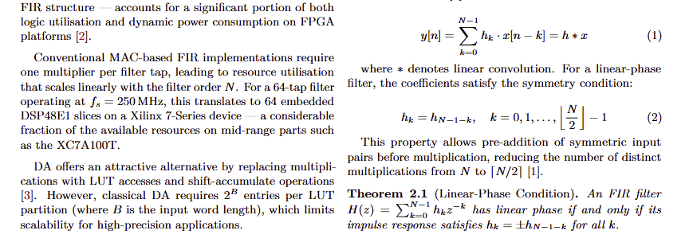
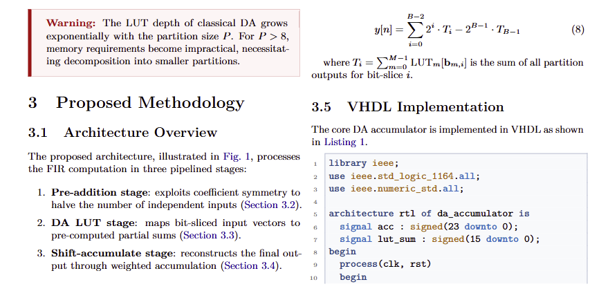
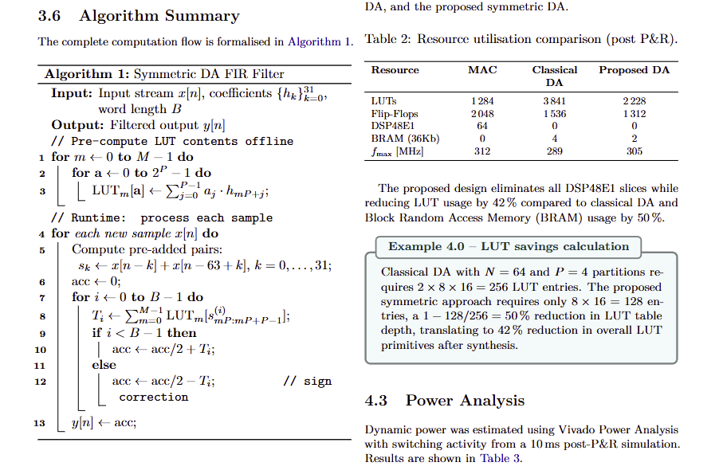

# EngTeX — Scientific Paper LaTeX Template

> **Professional LaTeX template for scientific articles, optimised for STEM disciplines and native IEEE two-column formatting.**
> 
> *Template LaTeX professionale per articoli scientifici, ottimizzato per le discipline STEM e con formattazione nativa a due colonne in stile IEEE.*


---

## 📄 Preview

<table>
  <thead>
    <tr>
      <th colspan="2">Pro Edition</th>
    </tr>
    <tr>
      <th>Italian Manual (ITA)</th>
      <th>English Manual (ENG)</th>
    </tr>
  </thead>
  <tbody>
    <tr>
      <td align="center"><a href="preview/ITA_Manuale_Paper.pdf">📥 Download PDF</a></td>
      <td align="center"><a href="preview/ENG_Manual_Paper.pdf">📥 Download PDF</a></td>
    </tr>
  </tbody>
</table>

---

## 🛒 Get EngTeX | Scarica EngTeX

<div align="center">

### [🚀 EngTeX Paper (Pro Edition)](https://sansalonelucag.gumroad.com/l/engtex-paper)

*The complete STEM toolkit for researchers: IEEE layout, theorems, code listings, and more.*

</div>

> 📘 **Need a step-by-step installation guide? | Serve una guida passo-passo?**
>
> **[VS Code + MiKTeX Setup Guide](../VSCode_MiKTeX_Guide)**

---

## ✨ Features | Funzionalità

### 🌍 Bilingual Support | Supporto Bilingue (ENG/ITA)

All labels (Abstract, Keywords, Theorem, Warning, etc.) switch automatically between English and Italian by changing a single word in your document class options.

Tutte le etichette (Sommario, Parole Chiave, Teorema, Attenzione, ecc.) si adattano automaticamente cambiando una sola parola nelle opzioni del documento.

```latex
\usepackage[english]{layout/stemset}   % English
\usepackage[italian]{layout/stemset}   % Italiano
```

### 📰 Two-Column Layout | Layout a Due Colonne (IEEE Style)

The template fully supports the IEEE-style `twocolumn` option natively. The title block will automatically span across both columns, while the abstract aligns to the left column.

Il template supporta nativamente l'opzione `twocolumn` in stile IEEE. Il blocco del titolo si estende su entrambe le colonne, mentre il sommario si allinea a sinistra.

```latex
\documentclass[10pt, a4paper, twocolumn]{article}
```

> 💡 *Tip:* Use `\resizebox{\columnwidth}{!}{...}` for large tables or TikZ diagrams, and the `split` environment from `amsmath` for long equations.

---

### 📐 Theorem Environments | Ambienti Teorema

| Environment | Italian label | Numbered |
| --- | --- | --- |
| `theorem` | Teorema | ✅ per section |
| `lemma` | Lemma | ✅ shared with theorem |
| `corollary` | Corollario | ✅ shared with theorem |
| `proposition` | Proposizione | ✅ shared with theorem |
| `remark` | Osservazione | ❌ unnumbered |

### 🎨 Custom Graphic Boxes | Box Grafici Personalizzati

| Command (EN) | Alias (IT) | Style |
| --- | --- | --- |
| `\definition{Title}{Text}` | `\definizione` | Blue box with title |
| `\note{Text}` | `\nota` | Grey-blue lateral bar |
| `\warning{Text}` | `\attenzione` | Red lateral bar |
| `\example{Title}{Text}` | `\esempio` | Teal numbered box |

---

### 🧮 STEM & EE Math Macros | Macro Matematiche STEM & EE

Shortcuts for the most common notations in engineering:

Scorciatoie per le notazioni più comuni in ingegneria:

```latex
% Derivatives & integrals | Derivate e integrali
\der{f}{x}, \pder{V}{t}, \nder{f}{x}{2}, \diff

% Transforms | Trasformate
\fourier{}, \laplace{}, \ztrans{}, \invfourier{}, \invlaplace{}, \invztrans{}

% Phasors & complex | Fasori e complessi
\fasore{V}{\theta}, \real{}, \imag{}, \conj{z}

% Linear algebra | Algebra lineare
\transpose, \hermitian, \diag{}, \trace{}, \rank{}, \norm{x}, \abs{x}, \inner{x}{y}

% Probability & statistics | Probabilità e statistica
\expectval{X}, \prob{A}, \Var, \Cov, \given

% Optimisation | Ottimizzazione
\argmin, \argmax, \subjto, \order{n}

% EE-specific | Specifiche EE
\dB, \dBm, \snr, \sinr, \ber, \ser, \evm, \nf, \sinc, \conv

% Number sets | Insiemi numerici
\RR, \NN, \ZZ, \CC, \QQ
```

<div align="center">
  
</div>

---

### 💻 Code Listings | Listati di Codice

Dedicated style for each language, with both block and inline support:

Stile dedicato per ogni linguaggio, con supporto sia a blocco che inline:

| `style=` | Language | Inline command |
| --- | --- | --- |
| `vhdl` | VHDL (IEEE 1076-2008) | `\vhdlinline{}` |
| `c` | C | `\cinline{}` |
| `cpp` | C++ | `\cppinline{}` |
| `java` | Java | `\javainline{}` |
| `python` | Python | `\pythoninline{}` |
| `matlab` | MATLAB | `\matlabinline{}` |

<div align="center">
  
</div>

### 📊 Algorithm Pseudocode | Pseudocodice Algoritmi

Uses `algorithm2e` with `ruled`, `vlined`, `linesnumbered` options. Label auto-localised.

Usa `algorithm2e` con opzioni `ruled`, `vlined`, `linesnumbered`. Etichetta auto-localizzata.

<div align="center">
  
</div>

### 🔧 TikZ Diagram Macros | Macro Diagrammi TikZ

**Hardware datapath:** `\sysblock{}{}{}`, `\flowblock{}{}{}`, `\decblock{}{}{}`, `\startendblock{}{}{}`

**Generic block diagrams | Diagrammi a blocchi:** `\genericblock{}{}{}`, `\sumnode{}{}`, `\gainblock{}{}{}`

---

### 🔗 Additional Tools | Strumenti Aggiuntivi

- **Smart cross-referencing | Riferimenti incrociati**: `cleveref` with localised labels — use `\cref{fig:xxx}` instead of `Fig.~\ref{fig:xxx}`
- **Acronyms | Acronimi**: first occurrence expanded, then abbreviated (`acro` package)
- **IEEE bibliography | Bibliografia IEEE**: `biblatex` + `biber`, numeric citations `[1]`
- **SI units | Unità SI**: `\qty{150}{\MHz}`, `\qty{4.2}{\ns}` via `siunitx`

---

## 📂 File Structure | Struttura File

```
project/
├── main.tex                  ← entry point: metadata, language, sections
├── layout/
│   ├── stemset.sty           ← template engine (do not edit)
│   └── bibliografia.bib      ← bibliography references
├── sections/                 ← one .tex file per paper section
│   ├── introduction.tex
│   ├── background.tex
│   ├── methodology.tex
│   ├── results.tex
│   └── conclusion.tex
├── immagini/                 ← figures, diagrams, logos
└── docs/                     ← Manual ITA | ENG and one example paper
```

> **Golden rule | Regola d'oro:** only edit `main.tex` and files in `sections/`. Do not touch `stemset.sty`.
>
> Modifica solo `main.tex` e i file in `sections/`. Non toccare `stemset.sty`.

---

## ⚙️ Quick Customisation | Personalizzazione Rapida

```latex
% --- Language / Lingua ---
\usepackage[english]{layout/stemset}

% --- Paper metadata / Metadati ---
\papertitle{Your Paper Title}
\shorttitle{Short Title}    % appears in the running header
\authorlist{Author One\textsuperscript{1}, Author Two\textsuperscript{2}}
\affiliation{\textsuperscript{1}University, \textsuperscript{2}Company}
\correspondingemail{you@example.com}
\paperkeywords{keyword1, keyword2, keyword3}

% --- Acronyms / Acronimi ---
\DeclareAcronym{fpga}{short=FPGA, long=Field Programmable Gate Array}
```

---

## 🚀 Getting Started

### Local — VS Code + MiKTeX ✅ (recommended | consigliato)

1. Install [MiKTeX](https://miktex.org) (Windows) or [TeX Live](https://tug.org/texlive/) (Linux/macOS)
2. Install [VS Code](https://code.visualstudio.com) with the **LaTeX Workshop** extension
3. Extract the folder and open it in VS Code
4. Open `main.tex`, set the language option and edit the quick-customisation block
5. Build: `pdflatex → biber → pdflatex → pdflatex`

> 📘 **[Complete setup guide → VS Code + MiKTeX](https://github.com/Sansalone-LucaG/EngTeX/tree/main/VSCode_MiKTeX_Guide)**

### Overleaf ⚠️ (free plan limitations apply)

> The Overleaf **free** plan may time out due to heavy packages (`tcolorbox`, `tikz`, `biblatex`).
> **Workaround:** temporarily comment out `tikz` sections while editing.
> Overleaf **Premium** compiles without issues.
>
> Il piano **gratuito** di Overleaf può andare in timeout per i pacchetti pesanti (`tcolorbox`, `tikz`, `biblatex`).
> **Soluzione:** commenta temporaneamente le sezioni `tikz` durante la modifica.
> Overleaf **Premium** compila senza problemi.

1. Go to [overleaf.com](https://www.overleaf.com) → **New Project → Upload Project**
2. Upload the `.zip` without extracting it
3. Set compiler to **pdfLaTeX** (Menu → Compiler)

---

<div align="center">

**Made with ❤️ for STEM students and engineers.**

*© 2026 Luca G. Sansalone — All rights reserved.*

</div>
