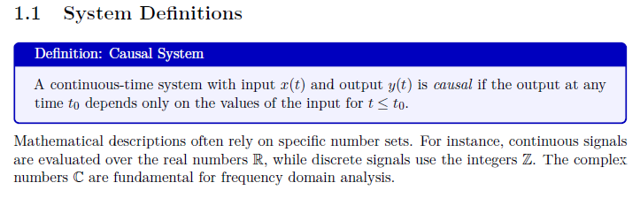
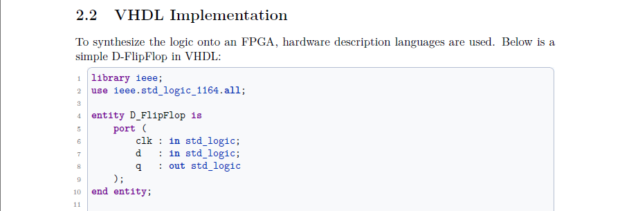

# EngTeX — Engineering LaTeX Template

> **Professional LaTeX template for technical reports, lab reports, and project documentation in engineering and IT.**
> 
> *Template LaTeX professionale per relazioni tecniche, report di laboratorio e documentazione di progetto in ambito ingegneristico e IT.*


---

## 📄 Preview

<table>
  <thead>
    <tr>
      <th colspan="2">Premium Edition</th>
      <th colspan="2">Lite Edition</th>
    </tr>
    <tr>
      <th>Italian Manual (ITA)</th>
      <th>English Manual (ENG)</th>
      <th>Italian Manual (ITA)</th>
      <th>English Manual (ENG)</th>
    </tr>
  </thead>
  <tbody>
    <tr>
      <td align="center"><a href="preview/ITA_Manuale_premium_version.pdf">📥 Download PDF</a></td>
      <td align="center"><a href="preview/ENG_Manual_premium_version.pdf">📥 Download PDF</a></td>
      <td align="center"><a href="preview/ITA_Manuale_lite_version.pdf">📥 Download PDF</a></td>
      <td align="center"><a href="preview/ENG_Manual_lite_version.pdf">📥 Download PDF</a></td>
    </tr>
  </tbody>
</table>


---

## 💎 Two Editions | Due Versioni

EngTeX is available in two editions to fit every need and budget:

EngTeX è disponibile in due versioni per ogni esigenza e budget:

| Feature | Lite (€1.50) | Premium (€9.99) |
| :--- | :---: | :---: |
| **Professional Layout & Typography** | ✅ | ✅ |
| **Bilingual Labels (ENG / ITA)** | ✅ | ✅ |
| **IEEE Bibliography** | ✅ | ✅ |
| **Syntax Highlighting** — VHDL, C, C++, Java | ✅ | ✅ |
| **Basic Math Macros** — Derivatives, Phasors, Sets | ✅ | ✅ |
| **4 Graphic Boxes** — Definition, Note, Warning, Example | ✅ | ✅ |
| **SI Units** via `siunitx` | ✅ | ✅ |
| **Syntax Highlighting** — Python, MATLAB, Bash, LaTeX | ❌ | ✅ |
| **Advanced Math** — Integrals, Limits, LinAlg, Prob & Stats, Vector Operators | ❌ | ✅ |
| **9 Extra Boxes** — Theorem, Lemma, Corollary, Proof, Remember, Tip, Exam, Curiosity... | ❌ | ✅ |
| **TikZ Block Diagrams** — Hardware & Flowcharts | ❌ | ✅ |
| **Equation Wrappers** — `\eqn{}{}`, `\eqns{}{}` | ❌ | ✅ |
| **Circuitikz Integration** — Electrical Circuits | ❌ | ✅ |
| **Algorithm2e Integration** — Pseudocode & Algorithms | ❌ | ✅ |
| **Acronyms** | ❌ | ✅ |

---

## 🛒 Get EngTeX | Scarica EngTeX

<div align="center">

### [📦 EngTeX Lite — €1.50](https://sansalonelucag.gumroad.com/l/engtex-lite)
*All the essentials to write professional reports right away.*

### [🚀 EngTeX Premium — €9.99](https://sansalonelucag.gumroad.com/l/engtex)
*The complete STEM toolkit: theorems, circuits, algorithms, plots, and more.*

</div>

> 📘 **Need a step-by-step installation guide? | Serve una guida passo-passo?**
>
> **[VS Code + MiKTeX Setup Guide](https://github.com/Sansalone-LucaG/EngTeX/tree/main/VSCode_MiKTeX_Guide/README.md)**

---

## ✨ Features

### 📦 Modular Architecture

You can load only the packages you need to speed up compilation.
Puoi caricare solo i pacchetti che ti servono per velocizzare la compilazione.

```latex
\usepackage[
  language=english,
  modules={math,boxes,code,algorithms,tikz,circuits}
]{package/engtex}
```

### 🌍 Bilingual Support | Supporto Bilingue

All labels (Abstract, Keywords, Theorem, Warning, etc.) switch automatically between English and Italian by changing the `language` option in the package:

```latex
\usepackage[language=english]{package/engtex}   % English
\usepackage[language=italian]{package/engtex}   % Italiano
```

### 🎨 Custom Graphic Boxes

Visual environments invoked with a single command. Labels switch automatically between English and Italian.

| Command (EN) | Alias (IT) | Style | Edition |
| --- | --- | --- | :---: |
| `\definition{Title}{Text}` | `\definizione` | Blue box with title | Lite |
| `\note{Text}` | `\nota` | Grey-blue lateral bar | Lite |
| `\warning{Text}` | `\attenzione` | Red lateral bar | Lite |
| `\example{Title}{Text}` | `\esempio` | Teal numbered box | Lite |
| `\theorem{Title}{Text}` | `\teorema` | Purple numbered box | Premium |
| `\corollary{Title}{Text}` | `\corollario` | Light purple box | Premium |
| `\lemmaenv{Title}{Text}` | `\lemma` | Violet box | Premium |
| `\proposition{Title}{Text}` | `\proposizione` | Blue box | Premium |
| `\proofenv{Text}` | `\dimostrazione` | Proof with QED ∎ | Premium |
| `\remember{Text}` | `\ricorda` | Yellow remember box | Premium |
| `\tip{Text}` | `\suggerimento` | Green tip box | Premium |
| `\examquestion{Text}` | `\domandaesame` | Orange exam box | Premium |
| `\curiosity{Text}` | `\curiosita` | Magenta fun fact box | Premium |

<div align="center">
  
</div>

---

### 💻 Syntax Highlighting for 7 Languages

Dedicated style for each language, with both block and inline support:

| `style=` | `compact` variant | Inline command |
| --- | --- | --- |
| `vhdl` | `vhdlcompact` | `\vhdlinline{}` |
| `c` | `ccompact` | `\cinline{}` |
| `cpp` | `cppcompact` | `\cppinline{}` |
| `java` | `javacompact` | `\javainline{}` |
| `python` | `pythoncompact` | `\pythoninline{}` |
| `matlab` | `matlabcompact` | `\matlabinline{}` |
| `bash` | `bashcompact` | `\bashinline{}` |
| `latex` | `latexcompact` | |

> 🎨 **Premium:** VHDL keywords are color-matched to **Xilinx Vivado** defaults — purple keywords, blue types, grey comments.

<div align="center">
  
</div>

---

### 📐 STEM Math Macros

Shortcuts for the most common notations in engineering:

```latex
% Both editions:
\der{f}{x}          % df/dx
\fourier{f(t)}      % f(t) -> F(s)
\laplace{h(t)}      % Laplace transform
\fasore{220}{30°}   % phasor notation
\RR, \NN, \ZZ, \CC  % number sets
\norm{x}            % vector norm
\abs{x}             % absolute value
\notlog{A \cdot B}  % Boolean NOT
\grad, \curl, \lap  % vector operators

% Premium only:
\pder{f}{x}          % partial derivative
\dder{f}{x}          % second derivative
\nder{n}{f}{x}       % n-th derivative
\intab{a}{b}{f}{x}   % definite integral
\limit{x}{x0}        % limit
\summ{i}{n}          % Sum from i to n
\prodd{i}{n}         % Product from i to n
\prob{E}, \expval{X} % probability
\tr{A}, \rank{A}     % linear algebra
\eqn{label}{formula} % numbered equation
... and many more ...
```

---

### 🔧 Document Tools

- **Version control** — `\renewcommand{\versiondoc}{1.0}` in `main.tex`, auto-propagates to cover page
- **Automatic acronyms** — first occurrence expanded, subsequent abbreviated (`acro` package)
- **IEEE bibliography** — `biblatex` + `biber`, numeric citations `[1]`, auto-generated section
- **SI units** — `\qty{150}{\MHz}`, `\qty{4.2}{\ns}` via `siunitx`

---

### ⚡ Circuitikz (Premium Only)

- **Electrical circuits** via seamless `circuitikz` integration (load the `circuits` module).

---

## 📂 File Structure

```text
project/
├── main.tex                  ← entry point: customisation and chapter order
├── package/                  ← all modular .sty files (engtex, engtex-math, etc.)
├── layout/
│   ├── frontespizio.tex      ← cover page
│   └── bibliografia.bib      ← BibTeX references
├── capitoli/                 ← one .tex file per chapter
├── immagini/                 ← figures, diagrams, logos
└── docs/                     ← user manual and example reports
```

> **Golden rule | Regola d'oro:** only edit `main.tex` and files in `capitoli/`.
> Use `\renewcommand` in `main.tex` to override defaults — do not edit `.sty` files directly.

---

## 🚀 Getting Started

### Local — VS Code + MiKTeX ✅ (recommended | consigliato)

1. Install [MiKTeX](https://miktex.org) (Windows) or [TeX Live](https://tug.org/texlive/) (Linux/macOS)
2. Install [VS Code](https://code.visualstudio.com) with the **LaTeX Workshop** extension
3. Extract the folder and open it in VS Code
4. Open `main.tex`, set the language option and edit the quick-customisation block
5. Build: `pdflatex → biber → pdflatex → pdflatex`

> 📘 **[Complete setup guide → VS Code + MiKTeX](https://github.com/Sansalone-LucaG/EngTeX/tree/main/VSCode_MiKTeX_Guide/README.md)**

### Overleaf ⚠️ (free plan limitations apply)

> The Overleaf **free** plan may time out due to heavy packages (`tcolorbox`, `tikz`, `biblatex`).
> **Workaround:** only load the modules you strictly need, or temporarily comment out one chapter while editing.
> Overleaf **Premium** compiles without issues.

1. Go to [overleaf.com](https://www.overleaf.com) → **New Project → Upload Project**
2. Upload the `.zip` without extracting it
3. Set compiler to **pdfLaTeX** (Menu → Compiler)

---

## ⚙️ Quick Customisation

```latex
% In main.tex — set document language and modules:
\usepackage[
  language=english,
  modules={math,boxes,code,algorithms,tikz,circuits}
]{package/engtex}

% Set document version:
\renewcommand{\versiondoc}{1.0}

% Declare acronyms:
\DeclareAcronym{fpga}{short=FPGA, long=Field Programmable Gate Array}
```

---

## 📋 What You Get

### EngTeX Lite (€1.50)
- ✅ Professional layout with custom typography
- ✅ 4 graphic boxes (Definition, Note, Warning, Example)
- ✅ VHDL / C / C++ / Java / Python / MATLAB syntax highlighting
- ✅ Basic math macros (derivatives, transforms, phasors, sets)
- ✅ IEEE bibliography with BibLaTeX + Biber
- ✅ SI units support
- ✅ Bilingual labels (IT / EN)

### EngTeX Premium (€9.99)
- ✅ Everything in Lite, plus:
- ✅ 13 graphic boxes total (+ Theorem, Lemma, Corollary, Proof, Remember, Tip, Exam, Curiosity)
- ✅ Advanced math (integrals, limits, vector operators, linear algebra, probability and many more)
- ✅ Equation wrappers with auto-labeling
- ✅ Electrical circuits via Circuitikz
- ✅ Pseudocode via Algorithm2e
- ✅ Automatic acronym management
- ✅ Complete 4-chapter manual (IT + EN)
- ✅ Bash syntax highlighting
- ✅ Example reports included

---

<div align="center">

**Made with ❤️ for STEM students and engineers.**

*© 2026 Luca G. Sansalone — All rights reserved.*

</div>
